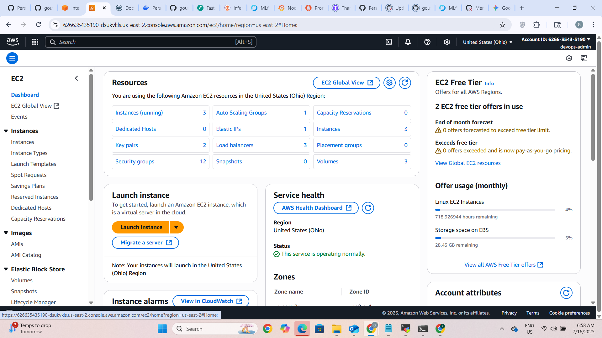
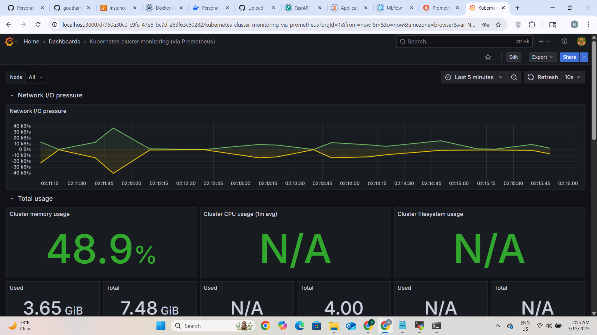
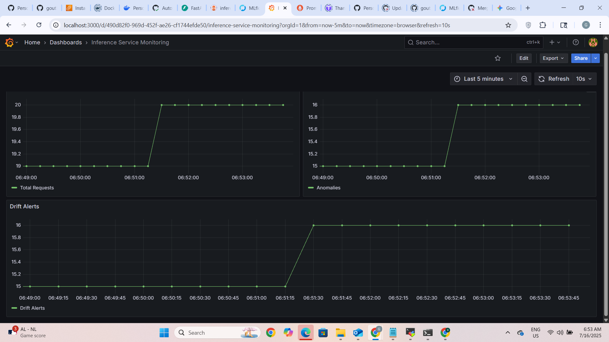
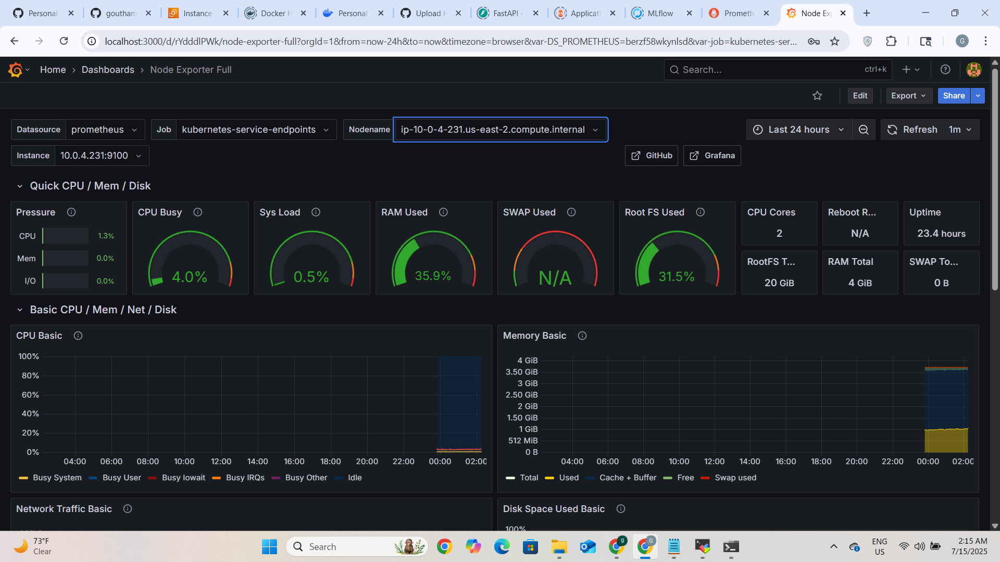
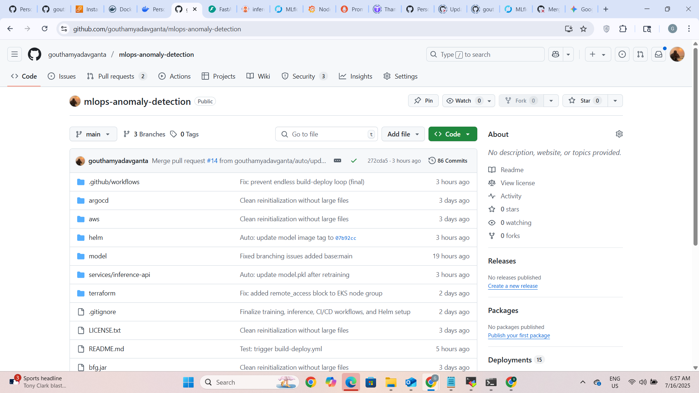

# 🚀 Real-Time Anomaly Detection – MLOps System


This project demonstrates a production-ready, cloud-native MLOps pipeline that automates the full lifecycle of a real-time anomaly detection model using modern DevOps, GitOps, and ML tooling. It is designed to:

- Showcase end-to-end MLOps expertise to recruiters, engineers, and hiring managers  
- Automate everything from training to deployment using CI/CD and GitHub Actions  
- Enable retraining and redeployment based on drift detection  
- Integrate observability and multi-layer security scanning  
- Use only scalable, industry-standard, cloud-native tools

---

## 🧰 Tech Stack

| Category         | Tool                               | Usage                                  |
|------------------|------------------------------------|----------------------------------------|
| Cloud            | AWS (EKS, S3, IAM, VPC)            | Hosting, storage, roles                |
| IaC              | Terraform                          | VPC, EKS, IAM, S3 (with remote backend)|
| CI/CD            | GitHub Actions                     | Model training, image build, chart publishing |
| GitOps           | ArgoCD                             | Helm-based continuous delivery         |
| ML/Serving       | IsolationForest + FastAPI          | Anomaly detection + REST API           |
| Tracking         | MLflow + S3 + SQLite               | Logs metrics/artifacts, tracks versions|
| Containerization | Docker + Docker Hub                | Build & registry                       |
| Monitoring       | Prometheus + Grafana               | Metrics, dashboards, alerts            |
| Drift Detection  | Custom logic + CronJob             | Detects drift and triggers retraining  |
| Security         | tfsec, TFLint, Trivy, CodeQL       | Infra, container, and code scanning    |

---

## 📐 System Architecture


---

## 🔄 End-to-End Pipeline

1. `train-model.yml` runs on schedule or manual dispatch
2. Trains IsolationForest model
3. Logs to MLflow and uploads artifacts to S3
4. Creates PR to update `model.pkl` in inference service
5. Merge triggers `build-deploy.yml`
6. Builds and pushes Docker image to Docker Hub
7. Creates PR to update image tag in `helm/values.yaml`
8. Merge triggers `upload-helm.yml`
9. Uploads Helm chart and index to S3 bucket
10. ArgoCD watches S3 chart index and syncs deployment to EKS

---

## ⚙️ CI/CD Workflows

| Workflow           | Trigger                         | Purpose                                      |
|--------------------|----------------------------------|----------------------------------------------|
| terraform.yml      | Push to terraform/** or manual  | Plan/apply infrastructure changes            |
| train-model.yml    | Manual dispatch or Cron         | Train model, log to MLflow, PR update model.pkl |
| build-deploy.yml   | Push to inference-api or model  | Build/push Docker image, PR update Helm tag  |
| upload-helm.yml    | Helm chart update               | Upload Helm chart and index to S3            |
| security.yml       | Every push to main              | tfsec, TFLint, Trivy, CodeQL scans           |

---

## 📦 Breakdown of Workflow Responsibilities

- ✅ **train-model.yml**  
  - Trains model with `train.py`  
  - Logs to MLflow and uploads to S3  
  - Creates PR to update `model.pkl`  

- ✅ **build-deploy.yml**  
  - Builds and pushes Docker image to Docker Hub  
  - Opens PR to update Helm image tag  

- ✅ **upload-helm.yml**  
  - Packages and uploads Helm chart to S3  

- ✅ **terraform.yml**  
  - Formats, initializes, validates, and plans infra  
  - Applies infra manually via GitHub Actions approval  

- ✅ **security.yml**  
  - Runs tfsec, TFLint, Trivy, and CodeQL  


---

## 🛠️ Infrastructure with Terraform

- Modularized under `terraform/modules/`
- `terraform/envs/dev/` handles:
  - Remote state in S3
  - State locking via DynamoDB
- Provisions:
  - VPC, subnets, NAT, IGW
  - IAM roles
  - EKS cluster + node group
  - S3 buckets for:
    - `model.pkl`
    - Helm chart repository


---

## 🚀 Deployment via ArgoCD + Helm

- Helm charts in `helm/inference-api/`
- Image tag updates via PR → merged
- ArgoCD tracks `argocd/inference-app.yaml`
- ArgoCD syncs deployment after chart update


---

## 🐳 Docker

- Two Dockerfiles:
  - `services/inference-api/`
  - `model/scripts/train.py`
- Images pushed to: `gantagouthamyadav/inference-api`


---

## 📊 Monitoring with Prometheus + Grafana

- Prometheus scrapes `/metrics` from FastAPI
- Grafana visualizes alerts, container metrics, and usage


---

## 📘 MLflow Tracking

- Logs parameters, metrics, and artifacts
- Stores models in S3
- Uses SQLite for lightweight backend


### 📊 Grafana Dashboards

#### Cluster Metrics


#### FastAPI Monitoring


#### Service Endpoint Overview



---

## 🧪 FastAPI Inference + Drift Logic

- REST endpoint accepts input features
- Returns prediction + drift detection score


---

## 📂 Folder Structure

```bash
mlops-anomaly-detection/
├── .github/workflows/       # GitHub Actions: CI/CD, Security
├── argocd/                  # ArgoCD app manifest
├── helm/                    # Helm chart (FastAPI)
├── model/                   # Training pipeline
│   └── scripts/train.py
├── services/                # Inference API (FastAPI)
├── terraform/               # IaC (modular)
│   ├── modules/
│   └── envs/dev/
├── simulate_stream.py       # Mock streaming simulator
├── screenshots/             # Proof of working implementation
```



---

## ✅ Results

- ✅ Fully automated MLOps lifecycle
- ✅ Drift triggers retraining via Cron + GitHub API
- ✅ Monitoring and alerting integrated
- ✅ Secure infrastructure and container scanning
- ✅ GitOps delivery with Helm + ArgoCD
- ✅ Clean, reproducible, scalable architecture

---

## 🧯 Troubleshooting

| Area      | Problem                         | Fix                                             |
|-----------|----------------------------------|--------------------------------------------------|
| MLflow    | Upload fails to S3               | Check AWS credentials via Kubernetes Secret     |
| ArgoCD    | Not syncing                      | Ensure Helm PR is merged and chart pushed       |
| Grafana   | Login issue                      | Reset Bitnami credentials                       |
| CronJob   | Not triggering                   | Run `kubectl get cronjob -n mlops`              |
| GitHub PR | Not created                      | Ensure `GH_PAT` is set in GitHub secrets        |

---

## 🧪 Local Testing

```bash
# Clone the project
git clone https://github.com/gouthamyadavganta/mlops-anomaly-detection.git
cd mlops-anomaly-detection

# Train model locally
python model/scripts/train.py

# Start FastAPI app
cd services/inference-api
uvicorn main:app --reload

# Simulate streaming
python simulate_stream.py
```

---

## 🧠 What Can Be Improved

- Add pytest unit tests for FastAPI and model
- Use IRSA instead of Kubernetes secrets for AWS
- Replace SQLite with PostgreSQL (RDS) for MLflow
- Add Kafka or Kinesis for real streaming
- Add load testing with Locust or k6

---

## 📚 References

- Terraform  
- MLflow  
- FastAPI  
- ArgoCD  
- Prometheus  
- Grafana  
- Trivy  
- CodeQL


> Feel free to reach out about MLOps, DevSecOps, cloud infrastructure, or collaboration opportunities.

## 📬 Contact

💻 **Author:** Goutham Yadav Ganta  
🌐 **GitHub:** [gouthamyadavganta](https://github.com/gouthamyadavganta)  
💼 **LinkedIn:** [www.linkedin.com/in/goutham-g-70408b228]  
📧 **Email:** gouthamyganta@gmail.com  
📍 **Location:** United States  
