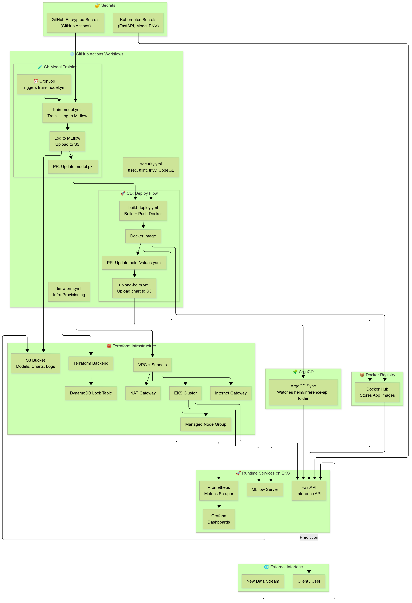
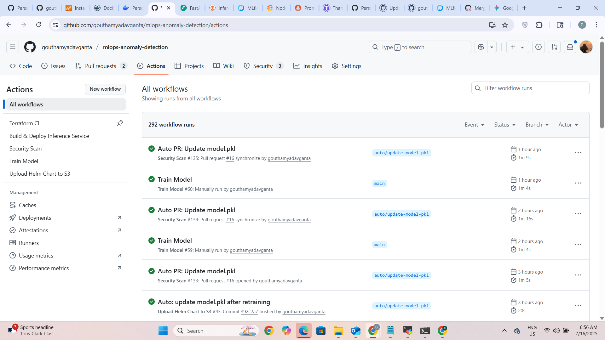
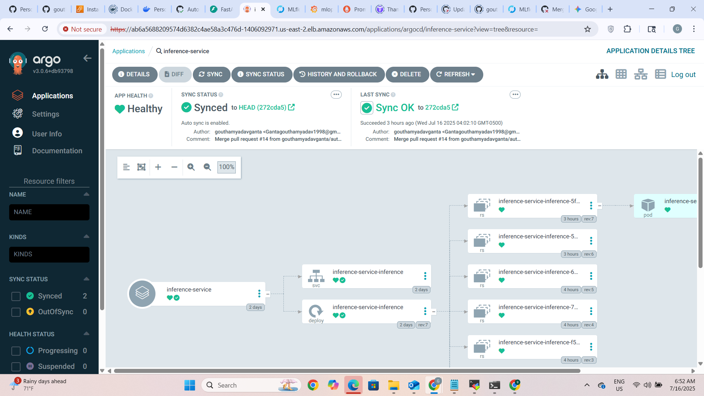
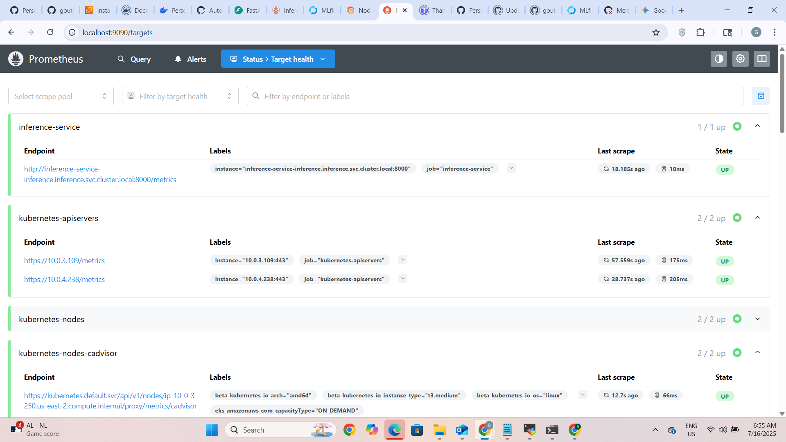
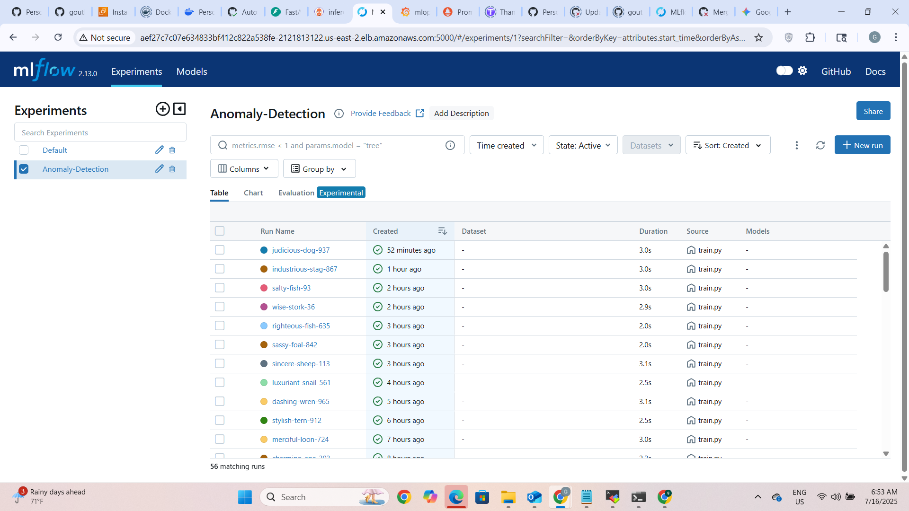
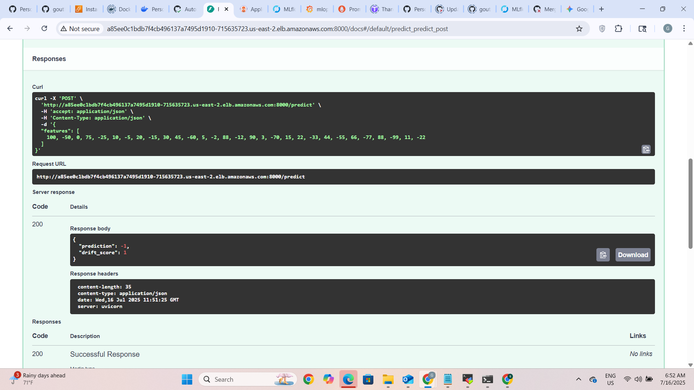
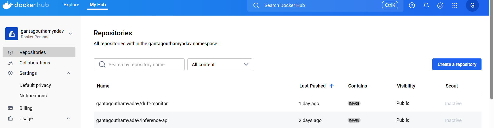

# 🚀 Real-Time Anomaly Detection – MLOps System

A **production-grade, cloud-native MLOps pipeline** that automates the full lifecycle of a real-time anomaly detection model using GitHub Actions, ArgoCD, MLflow, FastAPI, Terraform, Prometheus/Grafana, and more.



---

## 📌 Overview

This project showcases:

- Full MLOps automation: train → track → deploy
- Drift detection triggering retraining
- GitOps-based delivery via ArgoCD
- Real-time inference + monitoring + alerting
- Cloud-native AWS infrastructure provisioned by Terraform
- CI/CD pipelines with GitHub Actions
- Multi-layer security scans integrated into the pipeline

---

## 🧰 Tech Stack

| Category         | Tool                          |
|------------------|-------------------------------|
| **Infra**        | AWS (EKS, S3, IAM, VPC), Terraform |
| **CI/CD**        | GitHub Actions                |
| **GitOps**       | ArgoCD + Helm                 |
| **Serving**      | FastAPI + IsolationForest     |
| **Tracking**     | MLflow + S3                   |
| **Monitoring**   | Prometheus + Grafana          |
| **Security**     | tfsec, TFLint, Trivy, CodeQL  |
| **Container**    | Docker + Docker Hub           |

---

## 📐 System Architecture


---

## 🔄 MLOps Flow Overview

1. `train-model.yml` runs via CronJob or manual dispatch
2. Model logs to MLflow, uploads to S3, PR updates `model.pkl`
3. `build-deploy.yml` builds Docker image, PR updates `helm/values.yaml`
4. `upload-helm.yml` uploads Helm chart to S3
5. ArgoCD syncs the chart, deploys new inference pod to EKS

---

## ⚙️ GitHub Actions Workflows

| Workflow           | Trigger                        | Purpose |
|--------------------|--------------------------------|---------|
| `terraform.yml`    | push / manual                  | Infra plan & apply |
| `train-model.yml`  | CronJob or manual              | Train model + log to MLflow |
| `build-deploy.yml` | PR merge to model.pkl / app    | Build & push Docker image |
| `upload-helm.yml`  | Helm chart change              | Upload to S3 chart repo |
| `security.yml`     | every push                     | tfsec, tflint, trivy, CodeQL |



---

## 🖥️ Key Implementation Screenshots

### ✅ ArgoCD – GitOps in Action



---

### 📈 Prometheus – Metrics Collection



---

### 📘 MLflow – Model Tracking



---

### 🧪 FastAPI Inference & Drift Detection



---

### 🐳 Docker Hub – Container Registry



---

### ☁️ AWS Cloud Infrastructure


---

## 📦 Folder Structure

```bash
mlops-anomaly-detection/
├── .github/workflows/       # GitHub Actions pipelines
├── argocd/                  # ArgoCD application manifest
├── helm/                    # Helm chart for FastAPI
├── model/scripts/train.py   # Training pipeline
├── services/inference-api/  # Inference microservice (FastAPI)
├── terraform/               # IaC modules & envs
│   ├── modules/
│   └── envs/dev/
├── simulate_stream.py       # Mock streaming simulator
```

---

## 🔁 Drift Detection & Retraining

- Triggered via Kubernetes CronJob
- GitHub Actions retrains model → updates `model.pkl`
- Pipeline automatically redeploys updated service via GitOps

---

## 🧪 Local Testing

```bash
# Clone repo
git clone https://github.com/gouthamyadavganta/mlops-anomaly-detection.git
cd mlops-anomaly-detection

# Run model trainer
python model/scripts/train.py

# Run FastAPI locally
cd services/inference-api
uvicorn main:app --reload

# Simulate real-time input
python simulate_stream.py
```

---

## ✅ Outcomes

- ✅ GitOps deployment with ArgoCD
- ✅ Retraining via Cron + GitHub API
- ✅ Logs & artifacts tracked with MLflow
- ✅ Real-time REST API for prediction + drift
- ✅ Monitoring and alerting with Grafana
- ✅ Dockerized pipeline with CI/CD
- ✅ End-to-end secured: tfsec, Trivy, CodeQL

---

## 💡 Future Enhancements

- [ ] Replace MLflow SQLite with RDS (PostgreSQL)
- [ ] Integrate Kafka/Kinesis for live streaming
- [ ] Use IRSA for secure AWS credentials
- [ ] Add pytest-based unit tests
- [ ] Add load testing with Locust

---

## 👥 Audience

- 🎯 **Recruiters & Hiring Managers** – Demonstrates real DevSecOps & MLOps skills
- 🧑‍💻 **Engineers** – Cloud-native GitOps pipeline reference
- 🤝 **Contributors** – Modular and reusable project structure

---

## 📚 References

- [MLflow](https://mlflow.org)
- [FastAPI](https://fastapi.tiangolo.com/)
- [Terraform](https://developer.hashicorp.com/terraform)
- [Prometheus](https://prometheus.io/)
- [Grafana](https://grafana.com/)
- [ArgoCD](https://argo-cd.readthedocs.io/)
- [Trivy](https://aquasecurity.github.io/trivy/)
- [CodeQL](https://codeql.github.com/)
